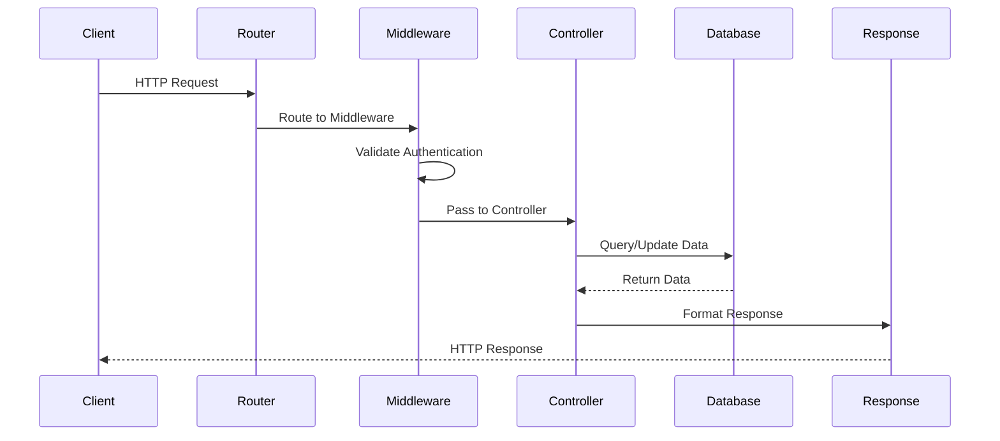

# Architecture Documentation

## 🏗️ System Architecture Overview

This RESTful API follows a **layered architecture pattern** with clear separation of concerns, making it maintainable, testable, and scalable.

## 📐 Architecture Layers

```
┌─────────────────────────────────────────────────────────────┐
│                    Presentation Layer                       │
│  ┌─────────────────┐  ┌─────────────────┐  ┌─────────────┐ │
│  │   HTTP Routes   │  │   Middlewares   │  │ Controllers │ │
│  │   (Express)     │  │  (Auth, Owner)  │  │ (Business)  │ │
│  └─────────────────┘  └─────────────────┘  └─────────────┘ │
└─────────────────────────────────────────────────────────────┘
                                │
                                ▼
┌─────────────────────────────────────────────────────────────┐
│                    Business Logic Layer                     │
│  ┌─────────────────┐  ┌─────────────────┐  ┌─────────────┐ │
│  │   Helpers       │  │   Services      │  │  Utilities  │ │
│  │ (Auth, Crypto)  │  │ (User Logic)    │  │ (Validation)│ │
│  └─────────────────┘  └─────────────────┘  └─────────────┘ │
└─────────────────────────────────────────────────────────────┘
                                │
                                ▼
┌─────────────────────────────────────────────────────────────┐
│                      Data Access Layer                      │
│  ┌─────────────────┐  ┌─────────────────┐  ┌─────────────┐ │
│  │   Models        │  │   Database      │  │   Schemas   │ │
│  │  (Mongoose)     │  │  Operations     │  │ (Validation)│ │
│  └─────────────────┘  └─────────────────┘  └─────────────┘ │
└─────────────────────────────────────────────────────────────┘
                                │
                                ▼
┌─────────────────────────────────────────────────────────────┐
│                      Infrastructure Layer                   │
│  ┌─────────────────┐  ┌─────────────────┐  ┌─────────────┐ │
│  │   MongoDB       │  │   Environment   │  │   Logging   │ │
│  │   Database      │  │   Variables     │  │   System    │ │
│  └─────────────────┘  └─────────────────┘  └─────────────┘ │
└─────────────────────────────────────────────────────────────┘
```

## 🔄 Request Flow



## 🏛️ Design Patterns

### 1. **Layered Architecture Pattern**
- **Separation of Concerns**: Each layer has a specific responsibility
- **Dependency Direction**: Dependencies flow downward only
- **Testability**: Each layer can be tested independently

### 2. **Repository Pattern**
- **Data Abstraction**: Database operations are abstracted through repository functions
- **Testability**: Easy to mock database operations
- **Flexibility**: Can switch database implementations without changing business logic

### 3. **Middleware Pattern**
- **Cross-cutting Concerns**: Authentication, logging, validation
- **Chain of Responsibility**: Middlewares are chained together
- **Reusability**: Middlewares can be reused across different routes

### 4. **Factory Pattern**
- **Router Creation**: Router factory functions for modular route organization
- **Object Creation**: Consistent object creation patterns

## 📁 Directory Structure Analysis

```
src/
├── controllers/          # Presentation Layer
│   ├── authentication.ts # Auth business logic
│   └── users.ts         # User business logic
├── db/                  # Data Access Layer
│   └── user.ts          # Database operations & models
├── helpers/             # Business Logic Layer
│   └── index.ts         # Utility functions
├── middlewares/         # Cross-cutting Concerns
│   └── index.ts         # Authentication & authorization
├── router/              # Presentation Layer
│   ├── index.ts         # Main router factory
│   ├── authentication.ts # Auth routes
│   └── users.ts         # User routes
└── index.ts             # Application entry point
```

## 🔐 Security Architecture

### Authentication Flow
```
User Request → Cookie Extraction → Token Validation → User Lookup → Request Authorization
```

### Security Layers
1. **Input Validation**: Request body validation
2. **Authentication**: Session token verification
3. **Authorization**: Ownership validation
4. **Data Protection**: Password hashing with salt
5. **Environment Security**: Sensitive data in environment variables

## 🚀 Scalability Considerations

### Horizontal Scaling
- **Stateless Design**: No server-side session storage
- **Database Scaling**: MongoDB supports horizontal scaling
- **Load Balancing**: Stateless design enables easy load balancing

### Performance Optimizations
- **Connection Pooling**: Mongoose handles connection pooling
- **Indexing**: Database indexes for efficient queries
- **Compression**: Response compression middleware
- **Caching**: Session tokens for reduced database queries

## 🔧 Configuration Management

### Environment-based Configuration
```typescript
// Centralized configuration
const config = {
  database: process.env.MONGO_URL,
  secret: process.env.SECRET,
  port: process.env.PORT || 8080,
  authTokenName: process.env.AUTH_TOKEN_NAME || 'AUTH_TOKEN'
};
```

### Benefits
- **Environment Separation**: Different configs for dev/staging/prod
- **Security**: Sensitive data not in code
- **Flexibility**: Easy configuration changes without code changes

## 📊 Data Flow Architecture

### User Registration Flow
```
Client → Router → Controller → Helper (Hash) → Database → Response
```

### User Authentication Flow
```
Client → Router → Middleware (Auth) → Controller → Database → Response
```

### Protected Resource Access
```
Client → Router → Middleware (Auth) → Middleware (Owner) → Controller → Database → Response
```

## 🎯 Key Architectural Decisions

### 1. **TypeScript for Type Safety**
- **Benefits**: Compile-time error detection, better IDE support
- **Trade-offs**: Additional build step, learning curve

### 2. **MongoDB with Mongoose**
- **Benefits**: Flexible schema, good TypeScript support
- **Trade-offs**: NoSQL complexity, eventual consistency

### 3. **Custom Authentication**
- **Benefits**: Full control, no external dependencies
- **Trade-offs**: More implementation complexity

### 4. **ES Modules**
- **Benefits**: Modern JavaScript, tree shaking
- **Trade-offs**: Compatibility considerations

## 🔄 Error Handling Strategy

### Error Propagation
```
Database Error → Controller → Middleware → Client
```

### Error Types
1. **Validation Errors**: 400 Bad Request
2. **Authentication Errors**: 403 Forbidden
3. **Not Found Errors**: 404 Not Found
4. **Server Errors**: 500 Internal Server Error

## 📈 Monitoring & Observability

### Logging Strategy
- **Request Logging**: All incoming requests
- **Error Logging**: Detailed error information
- **Performance Logging**: Response times and database queries

### Health Checks
- **Database Connectivity**: MongoDB connection status
- **Service Health**: Application status endpoints

## 🚀 Future Architecture Considerations

### Microservices Migration
- **Service Decomposition**: Split by business domains
- **API Gateway**: Centralized routing and authentication
- **Event-driven Architecture**: Asynchronous communication

### Advanced Features
- **Rate Limiting**: API throttling
- **Caching Layer**: Redis for session and data caching
- **Message Queue**: Background job processing
- **API Versioning**: Backward compatibility
