# System Diagrams

## 🏗️ Architecture Diagrams

### High-Level System Architecture

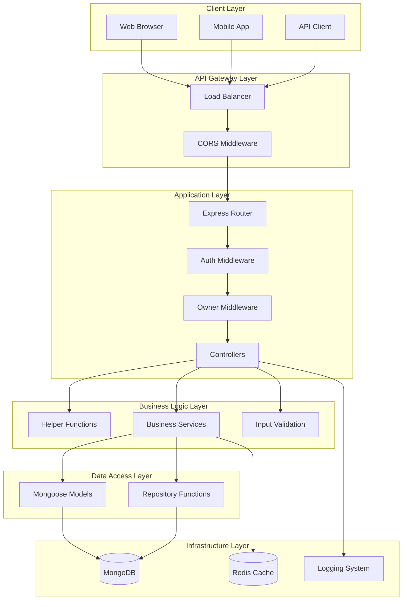

### Request Flow Diagram

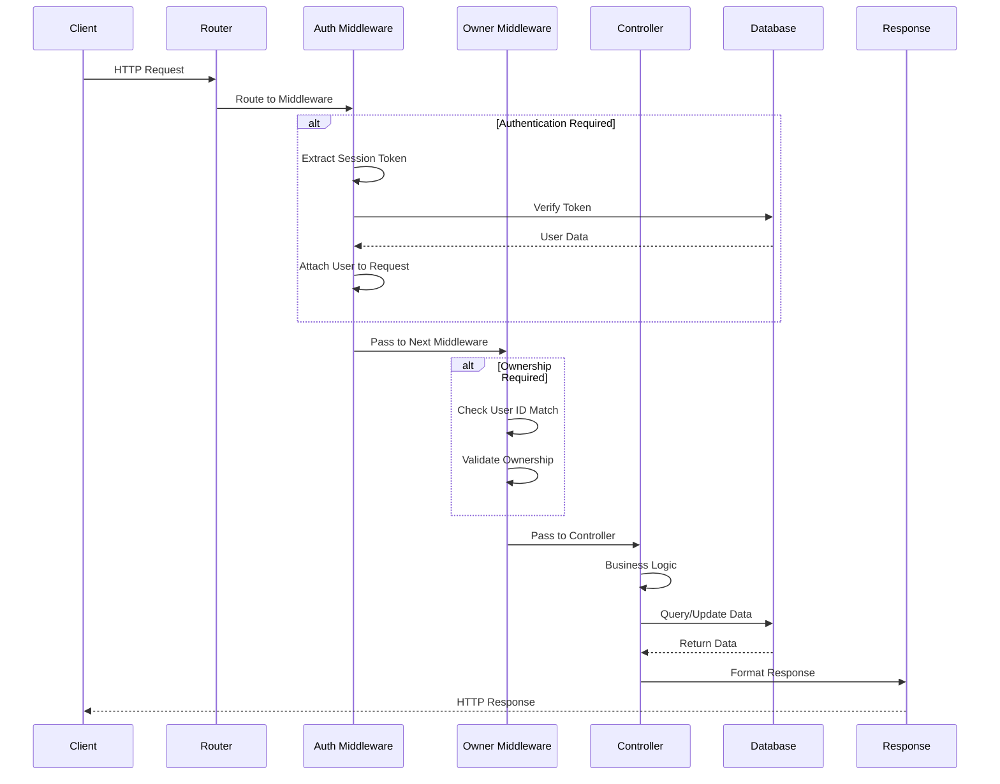

## 🔐 Authentication Flow Diagrams

### User Registration Flow

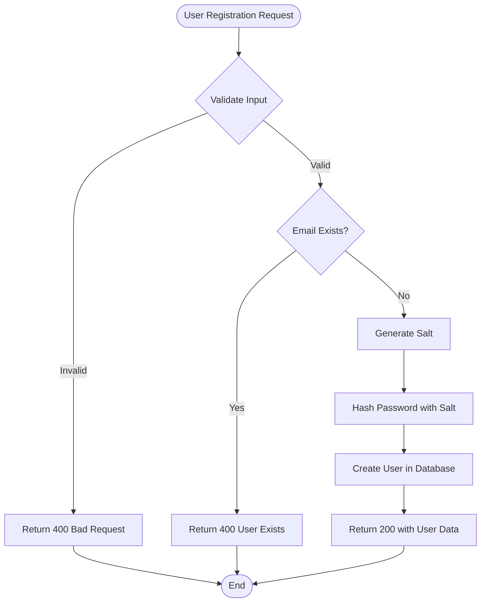

### User Login Flow

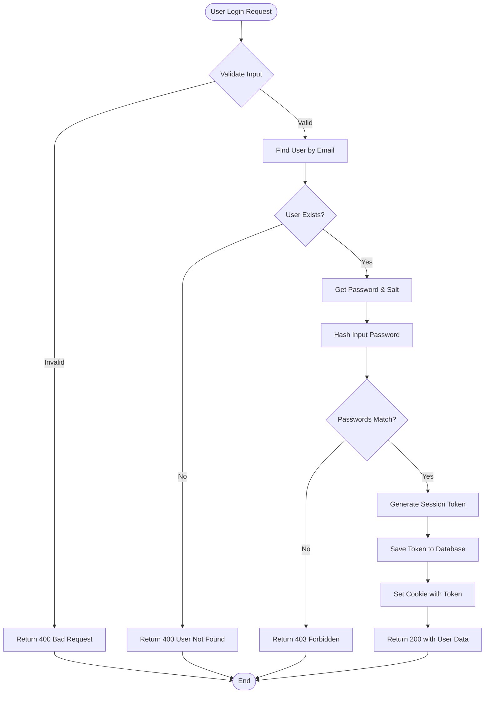

### Session Validation Flow

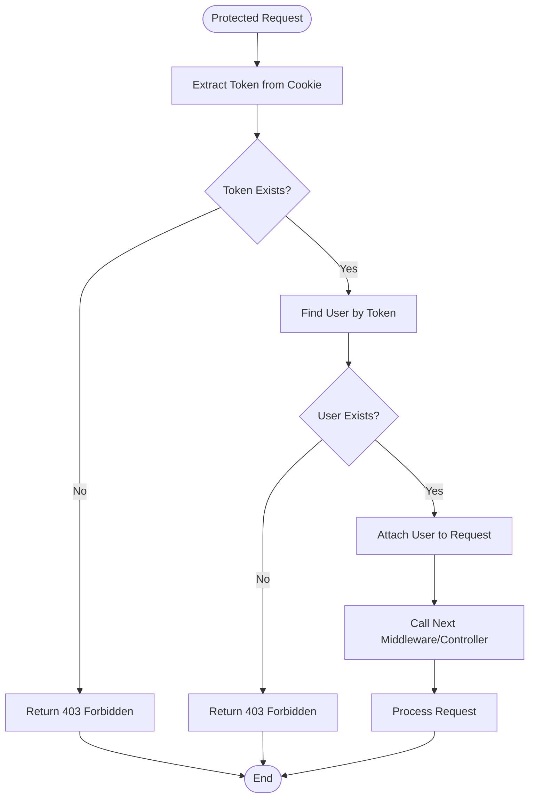

## 🗄️ Database Schema Diagrams

### User Document Structure

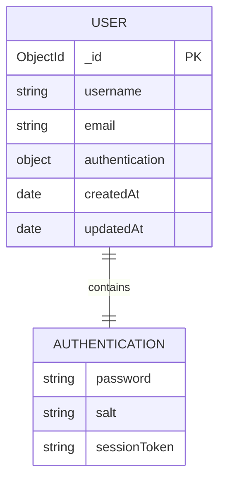

### Database Relationships

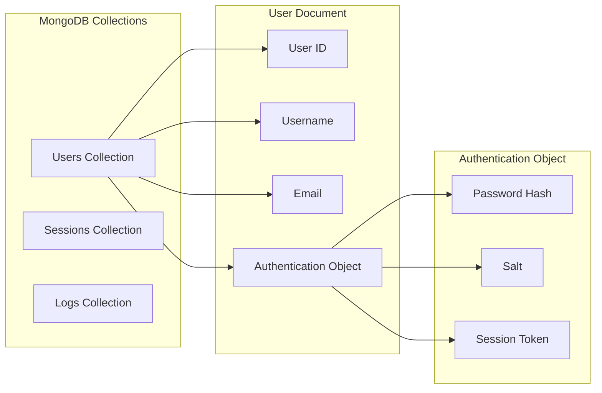

## 🔄 Data Flow Diagrams

### User CRUD Operations

```mermaid
flowchart TD
    subgraph "Create User"
        C1[POST /users] --> C2[Validate Input]
        C2 --> C3[Hash Password]
        C3 --> C4[Save to Database]
        C4 --> C5[Return User Data]
    end
    
    subgraph "Read User"
        R1[GET /users/:id] --> R2[Find User by ID]
        R2 --> R3[Return User Data]
    end
    
    subgraph "Update User"
        U1[PATCH /users/:id] --> U2[Validate Ownership]
        U2 --> U3[Update User Data]
        U3 --> U4[Save to Database]
        U4 --> U5[Return Updated Data]
    end
    
    subgraph "Delete User"
        D1[DELETE /users/:id] --> D2[Validate Ownership]
        D2 --> D3[Delete from Database]
        D3 --> D4[Return Success]
    end
```

### Password Hashing Process

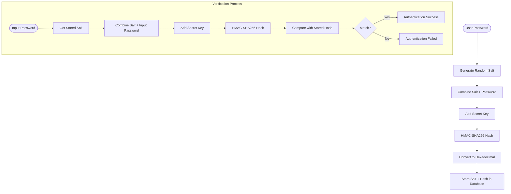

## 🚀 Deployment Architecture

### Development Environment

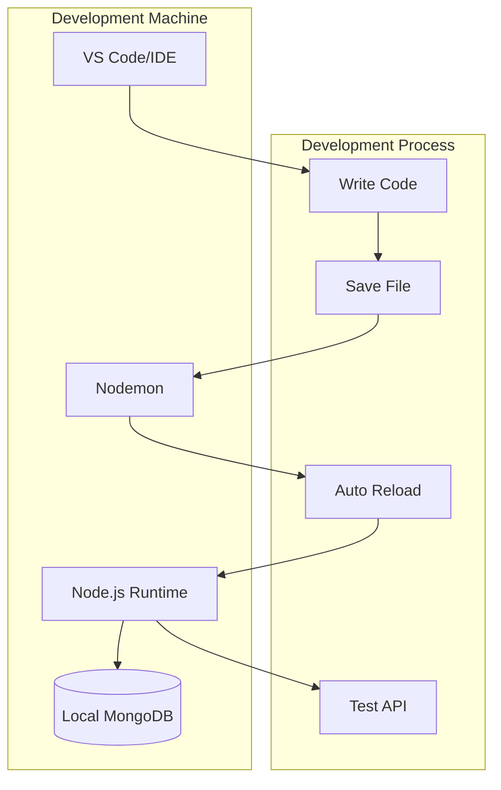

### Production Environment

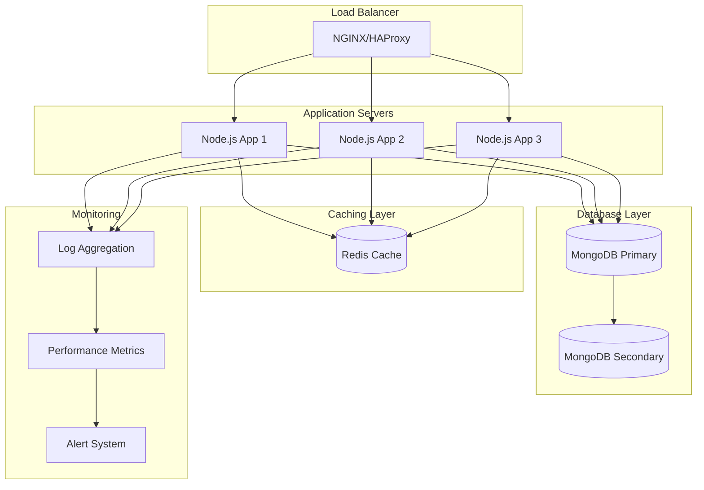

## 🔧 Component Interaction Diagram

### Middleware Chain

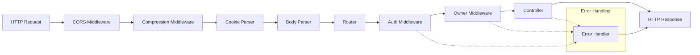

### Module Dependencies

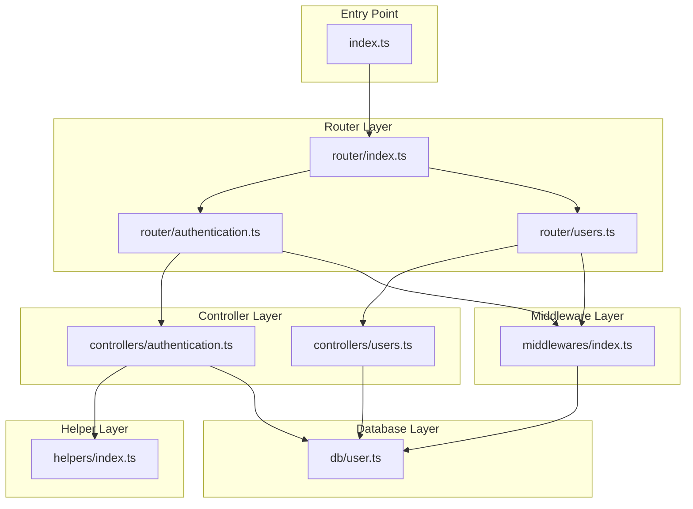

## 📊 Performance Monitoring Diagram

### Request Lifecycle

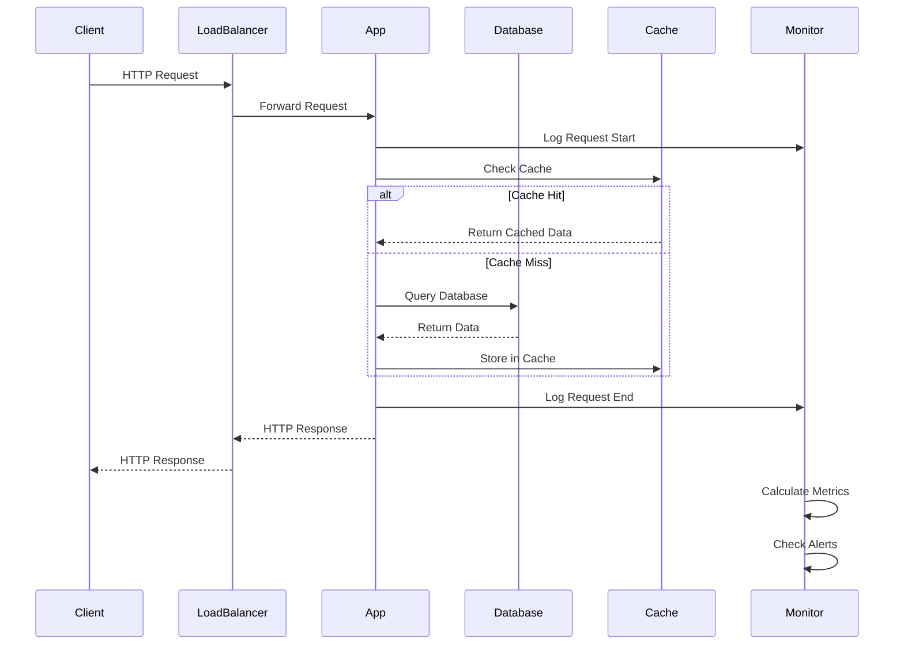

## 🛡️ Security Architecture

### Security Layers

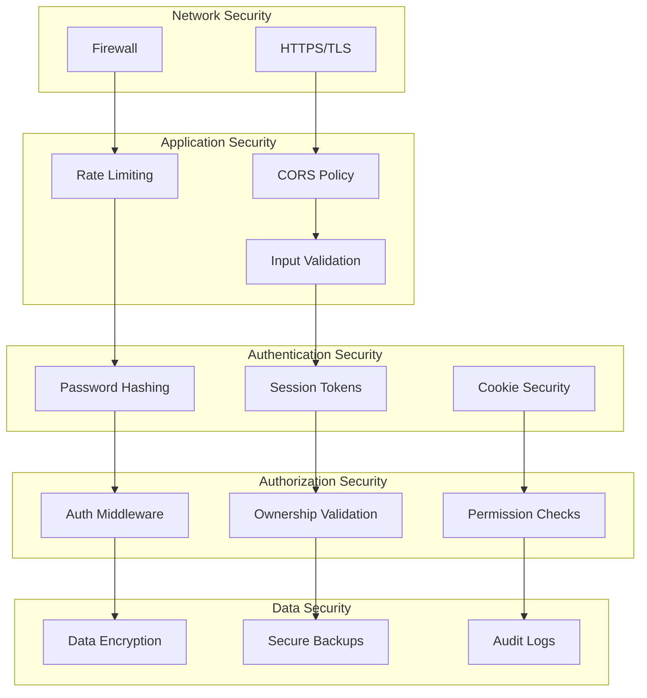

## 📈 Scalability Diagram

### Horizontal Scaling

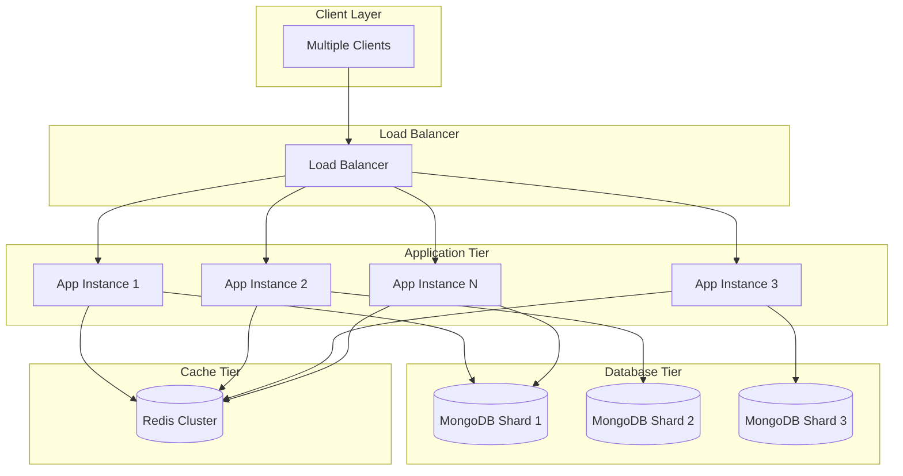

These diagrams provide a comprehensive visual representation of the system architecture, data flows, security layers, and scalability considerations for the RESTful API project.
